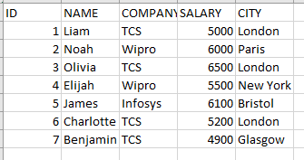
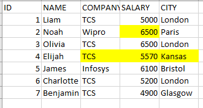

# scd-types

## Introduction

Slowly Changing Dimensions in Data Warehouse is an important concept that is used to enable the historic aspect of data in an analytical system. As you know, the data warehouse is used to analyze historical data, it is essential to store the different states of data.

## Summary

| Type  | Summary| Details
|-------|:-------|:-------|
|Type 0 | Fixed Dimension| No changes allowed, dimension never changes |
|Type 1 | No History |Update record directly, there is no record of historical values, only current state |
|Type 2 | Row Versioning |Track changes as version records with current flag & active dates and other metadata|
|Type 3 | Previous Value column |Track change to a specific attribute, add a column to show the previous value, which is updated as further changes occur. |
|Type 4 | History Table | Show current value in dimension table but track all changes in separate table.|
|Type 5 | --- |--- |
|Type 6 | Hybrid SCD|Utilise techniques from SCD Types 1, 2 and 3 to track change, 1+2+3 = 6|
|Type 7 | --- |--- |

## Details

### SCD Type 0 (SCD0)
[Implementation of SCD Type 0](https://github.com/mainak17/scd-types/blob/main/scd-0.py)

Input -> Output

### SCD Type 1 (SCD1)
[Implementation of SCD Type 1](https://github.com/mainak17/scd-types/blob/main/scd-1.py)
Input Day 1-> Output Day 1

Input Day 2-> Output Day 2

### SCD Type 2 (SCD2)
[Implementation of SCD Type 2](https://github.com/mainak17/scd-types/blob/main/scd-2.py)
